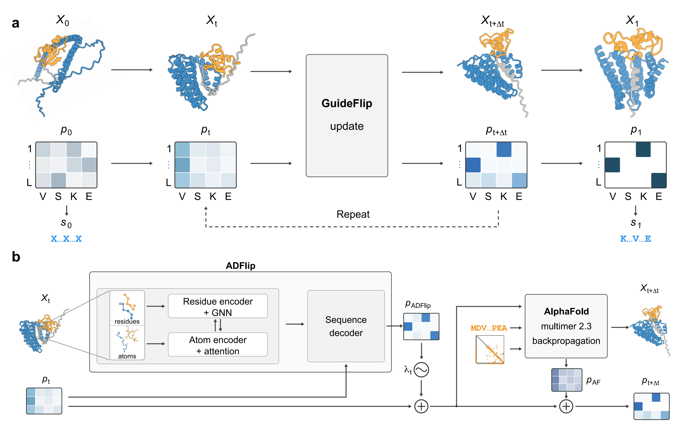

# De novo design of flexible protein interactions with GuideFlip



## Installation

GuideFlip requires Linux, an NVIDIA GPU with a compatible driver, Conda
(e.g. Miniforge), and `curl`. Clone the repository and install:

```bash
git clone https://github.com/ykiiiiii/GuideFlip.git
cd GuideFlip
bash installation/install.sh
conda activate guideflip
```

The script creates the `guideflip` environment, installs the required CUDA libraries,
and downloads the AlphaFold2 parameters (approximately 5.3 GB).

To reuse existing AlphaFold2 parameters, replace the installation command above with:

```bash
bash installation/install.sh --alphafold-params /path/to/params
```

### Optional: AF3

Obtain the AF3 model weights following the
[official instructions](https://github.com/google-deepmind/alphafold3/blob/main/docs/installation.md),
then run:

```bash
bash installation/install_af3.sh --model-dir /path/to/af3_weights
```

AF3 is installed in a separate environment and called automatically by GuideFlip.

## Usage

| Function | Example | Target input | Comments |
| --- | --- | --- | --- |
| Binder design for disordered targets | [Amylin](#amylin) | PDB, 37 residues | Target template fully withheld |
| Binder design for disordered targets | [α-Synuclein 100–140](#asyn-100-140) | Sequence, 41 residues | Initial structure predicted automatically |

### Binder design for disordered targets

Both examples design 105-residue binders with AF2 and AF3 validation, including
binder-only AF2 checks. To run without AF3, set `filters.af3.enabled` to `false`
in the example JSON.

#### Amylin

This [example](examples/amylin.json) uses a [37-residue amylin PDB](examples/amylin.pdb)
as input. Setting `rm_target` to `"A1-37"` withholds the entire target template
during design and AF2 validation.

```bash
python design.py --settings examples/amylin.json --output output/amylin
```

<a id="asyn-100-140"></a>

#### α-Synuclein 100–140

This [example](examples/asyn.json) uses residues 100–140 of human α-synuclein
([UniProt P37840](https://www.uniprot.org/uniprotkb/P37840/entry);
[UniProt licence](https://www.uniprot.org/help/license)) as a sequence-only input.
GuideFlip predicts an initial structure, then withholds the entire target template
during design and AF2 validation.

```bash
python design.py --settings examples/asyn.json --output output/asyn
```

Each command runs one design trajectory. Add `--trajectories 10` to run ten
trajectories. See [amylin_full.json](examples/amylin_full.json) for the complete
settings reference.

### Validation

AF2-Multimer and AF3 assess complex confidence using ipTM and iPAE min, and
structural agreement with the design model using DockQ iRMSD. Default thresholds
are ipTM ≥ 0.8, iPAE min ≤ 1.5 Å, and iRMSD ≤ 2 Å. AF2 monomer checks report
binder pLDDT and Cα RMSD without applying thresholds by default.

To relax filtering, lower `min_interface_ptm` or increase `max_ipae_min` and
`max_irmsd` in `filters.af2` and/or `filters.af3` in your settings JSON.

## Citation

If you use GuideFlip, please cite the [GuideFlip preprint](https://www.biorxiv.org/content/10.64898/2026.09.27.754145v1)
and the [ADFlip paper](https://openreview.net/forum?id=8tQdwSCJmA).

```bibtex
@article{yi2026guideflip,
  title   = {De novo design of flexible protein interactions with {GuideFlip}},
  author  = {Yi, Kai and Chen, Qingchao and Zhang, Dongqi and Tian, Pengfei and
             Wagstaff, Jane L. and McLaughlin, Stephen H. and Tate, Christopher G. and
             Jamali, Kiarash and Scheres, Sjors H. W.},
  journal = {bioRxiv},
  year    = {2026},
  doi     = {10.64898/2026.09.27.754145},
  url     = {https://www.biorxiv.org/content/10.64898/2026.09.27.754145v1}
}

@inproceedings{yi2025allatom,
  title     = {All-atom inverse protein folding through discrete flow matching},
  author    = {Kai Yi and Kiarash Jamali and Sjors HW Scheres},
  booktitle = {Forty-second International Conference on Machine Learning},
  year      = {2025},
  url       = {https://openreview.net/forum?id=8tQdwSCJmA}
}
```
